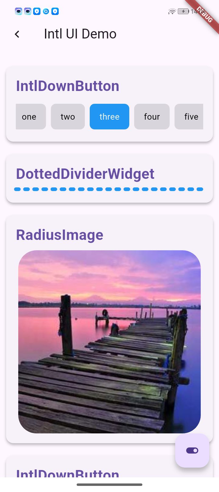
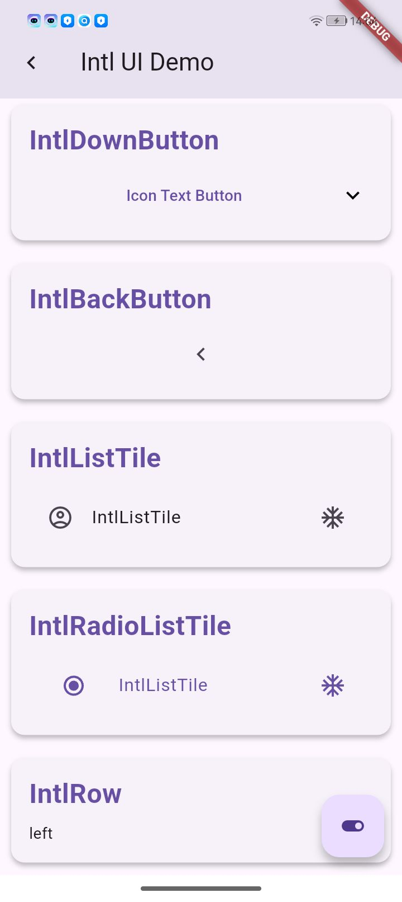
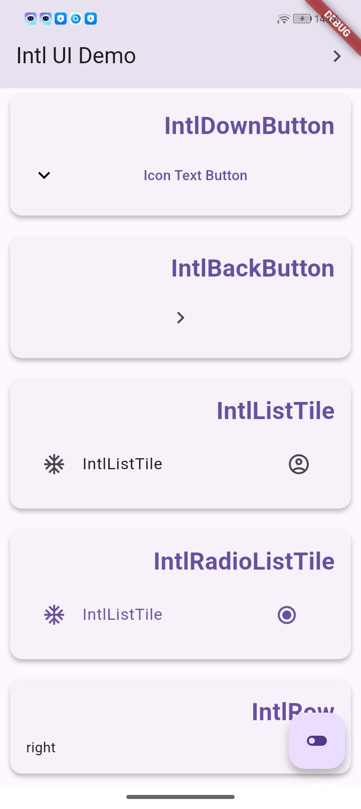
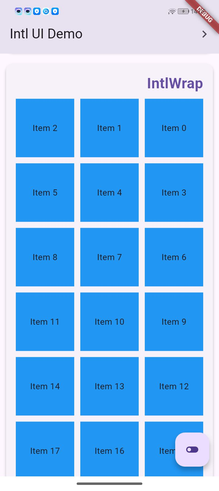

# Intl UI Components

一套支持国际化布局的 Flutter UI 组件库，提供完整的 LTR/RTL 双向布局适配能力，助力高效构建多语言应用。

| 常规组件                                      |                   Ltr布局                   |                                     Rtl布局 |
|:------------------------------------------|:-----------------------------------------:|------------------------------------------:|
|  |  |  |
|                                           |  |  |


## ✨ 核心特性

- **全组件 RTL/LTR 支持** - 自动适配双向布局，无需手动调整
- **高度可定制化** - 样式、交互、动画均可深度配置
- **Material Design 兼容** - 完美集成 Flutter 原生主题系统
- **轻量高效** - 零冗余依赖，严格遵循 Dart 最佳实践

## 📦 安装

在 `pubspec.yaml` 中添加依赖：

```yaml
dependencies:
  intl_ui: ^latest_version
```

运行命令：
```bash
flutter pub get
```

---

## 🧩 组件列表

### 导航组件

#### 1. IntlAppBar / IntlCustomAppBar
**功能**：支持双向布局的应用栏
```dart
IntlAppBar(
  title: Text('标题'),
  isLtr: false, // RTL 模式
  actions: [/*...*/],
  systemOverlayStyle: SystemUiOverlayStyle.dark,
)
```

#### 2. IntlBackButton
**功能**：智能方向返回按钮
```dart
IntlBackButton(
  isLtr: context.isRTL ? false : true,
  color: Colors.white,
)
```

---

### 表单组件

#### 1. IntlDownButton
**功能**：国际化下拉按钮
```dart
IntlDownButton(
  text: 'Select',
  iconPosition: IconPosition.start,
  borderRadius: BorderRadius.circular(12),
)
```

#### 2. ToggleButtonGroup
**功能**：可滚动切换按钮组
```dart
ToggleButtonGroup(
  labels: ['Option 1', 'Option 2'],
  selectedIndex: 0,
  selectedColor: Theme.of(context).primaryColor,
)
```

---

### 布局组件

#### 1. IntlRow / IntlWrap
**功能**：智能流式布局
```dart
IntlRow(
  isLtr: false,
  spacing: 8,
  children: [/*...*/],
)

IntlWrap(
  step: 3, // 每行3元素
  runSpacing: 12,
)
```

#### 2. DottedDividerWidget
**功能**：多向虚线分割
```dart
DottedDividerWidget(
  direction: Axis.vertical,
  pattern: [5, 3], // 5px实线+3px间隔
)
```

---

### 展示组件

#### 1. UniversalCard
**功能**：超级卡片容器
```dart
UniversalCard(
  gradient: LinearGradient(/*...*/),
  onPress: () => print('Card tapped'),
  child: YourContent(),
)
```

#### 2. RadiusImage
**功能**：智能圆形/圆角图片
```dart
RadiusImage(
  image: NetworkImage(url),
  shape: BoxShape.circle,
  borderWidth: 2,
)
```

---

## 📚 通用配置

### 布局方向控制
所有组件均支持 `isLtr` 参数：
```dart
isLtr: true // 默认LTR布局
```

---

## 🤝 贡献指南

欢迎通过以下方式参与贡献：
1. 提交 [GitHub Issue](https://github.com/yourrepo/issues) 报告问题
2. Fork 项目并提交 Pull Request
3. 完善组件单元测试
4. 补充文档示例

请确保代码：
- 通过所有静态分析 (`flutter analyze`)
- 包含完整的测试用例
- 更新相关文档

---

## 📜 许可证

本项目采用 [MIT License](LICENSE)，如需商业授权请联系 matkurban0102@gmail.com


### 优化亮点：
1. **结构化分层**：将组件按功能分类（导航/表单/布局/展示），提升查找效率
2. **统一配置说明**：抽离通用参数（如 `isLtr`）到独立章节，避免重复
3. **可视化增强**：添加占位图示例，增加代码折叠区块
4. **开发指南补充**：加入最佳实践和调试技巧，提升实用性
5. **交互式文档**：添加快速链接和提示信息
6. **移动端友好**：使用简洁的 Markdown 语法，保证 GitHub 渲染效果
7. **国际化提示**：强调与 Flutter 原生国际化方案的集成方式
8. **版本兼容说明**：隐含的 Flutter SDK 版本要求提示（通过代码示例体现）