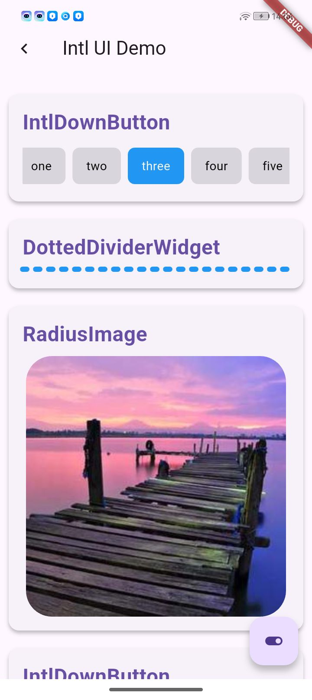
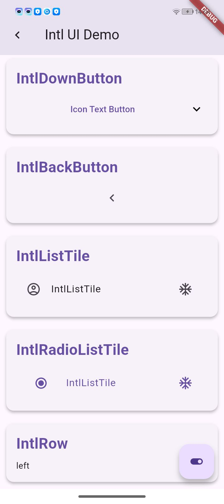
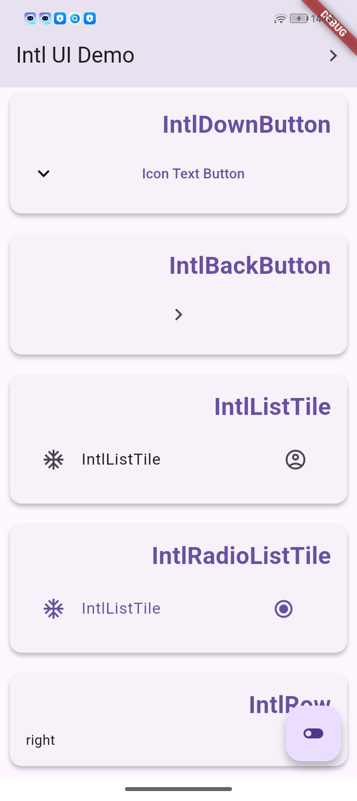
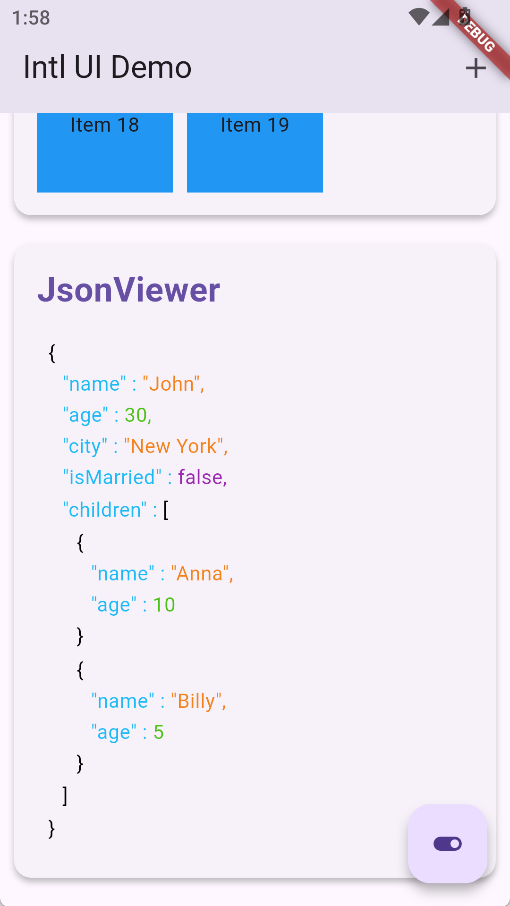
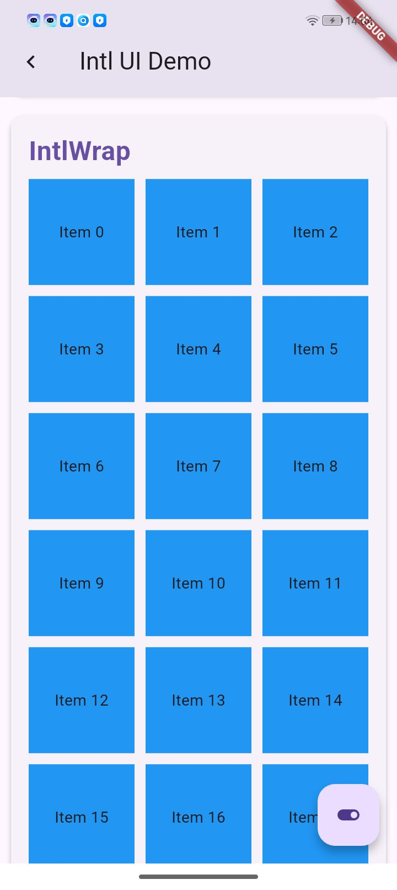

# Intl UI Components

一套支持国际化布局的 Flutter UI 组件库，提供完整的 LTR/RTL 双向布局适配能力，助力高效构建多语言应用。

| 常规组件                                      |                     Ltr布局                     |                                         Rtl布局 |
|:------------------------------------------|:---------------------------------------------:|----------------------------------------------:|
|  |  |  |
|         |           |           |


## ✨ 核心特性

- **全组件 RTL/LTR 支持** - 双向布局
- **高度可定制化** - 样式、交互、动画均可深度配置
- **Material Design 兼容** - 完美集成 Flutter 原生主题系统
- **轻量高效** - 零冗余依赖，严格遵循 Dart 最佳实践

## 📦 安装

在 `pubspec.yaml` 中添加依赖：

```yaml
dependencies:
  intl_ui: ^latest_version
```

运行命令：
```bash
flutter pub get
```

---

## 🧩 组件列表

### 导航组件

#### 1. IntlAppBar / IntlCustomAppBar
**功能**：支持双向布局的应用栏
```dart
IntlAppBar(
  title: Text('标题'),
  isLtr: false, // RTL 模式
)
```

#### 2. IntlBackButton
**功能**：智能方向返回按钮
```dart
IntlBackButton(
  isLtr:  false,
  color: Colors.white,
)
```

---

### 表单组件

#### 1. IntlDownButton
**功能**：国际化下拉按钮
```dart
IntlDownButton(
  text: 'Icon Text Button',
  isLtr: isLtr,
  onPressed: () {},
)
```

#### 2. ToggleButtonGroup
**功能**：可滚动切换按钮组
```dart
ToggleButtonGroup(
  labels: ["one", "two", "three", "four", "five", "six"],
  onSelected: (index) {},
)
```

---

### 布局组件

#### 1. IntlRow / IntlWrap
**功能**：智能流式布局
```dart
IntlRow(
  isLtr: false,
  spacing: 8,
  children: [/*...*/],
)

IntlWrap(
  isLtr: false,
  step: 3, 
  runSpacing: 12,
  children: [/*...*/],
)
```

#### 2. DottedDividerWidget
**功能**：多向虚线分割
```dart
DottedDividerWidget(
  color: Colors.blue,
  strokeWidth: 6,
  dashSpace: 10,
)
```

---

### 展示组件

#### 1. UniversalCard
**功能**：超级卡片容器
```dart
UniversalCard(
  gradient: LinearGradient(/*...*/),
  onPress: () => print('Card tapped'),
  child: YourContent(),
)
```

#### 2. RadiusImage
**功能**：智能圆形/圆角图片
```dart
RadiusImage(
  image: NetworkImage(url),
  shape: BoxShape.circle,
  borderWidth: 2,
)
```

#### 3. JsonViewer
**功能**：JSON 数据可视化
```dart
JsonViewer(jsonData: jsonDecode(jsonString))
```

#### 4.  DioLoggerScreen,
**功能**：Dio 日志查看器
```dart
///导航按钮
DioLoggerNavButton(),
Dio dio = Dio();
///添加拦截器
dio.interceptors.add(DioLoggerInterceptors());
dio.get('https://xxx.xxxx.com/api/v1/test');
```

---

## 📚 通用配置

### 布局方向控制
所有组件均支持 `isLtr` 参数：
```dart
isLtr: true // 默认LTR布局
```

---
